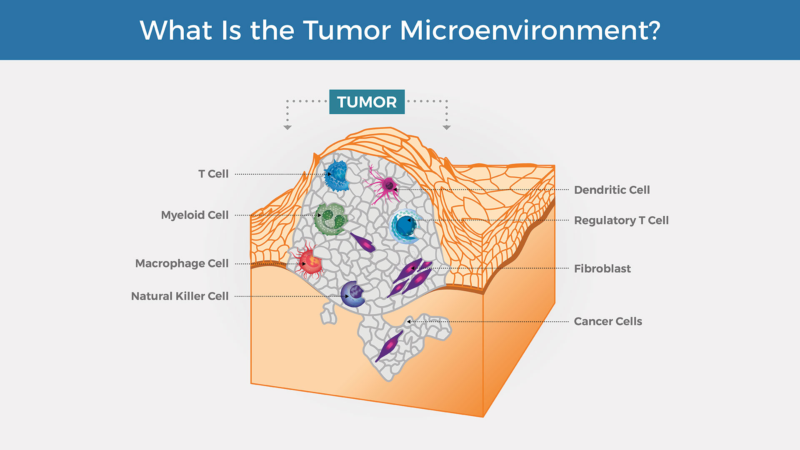
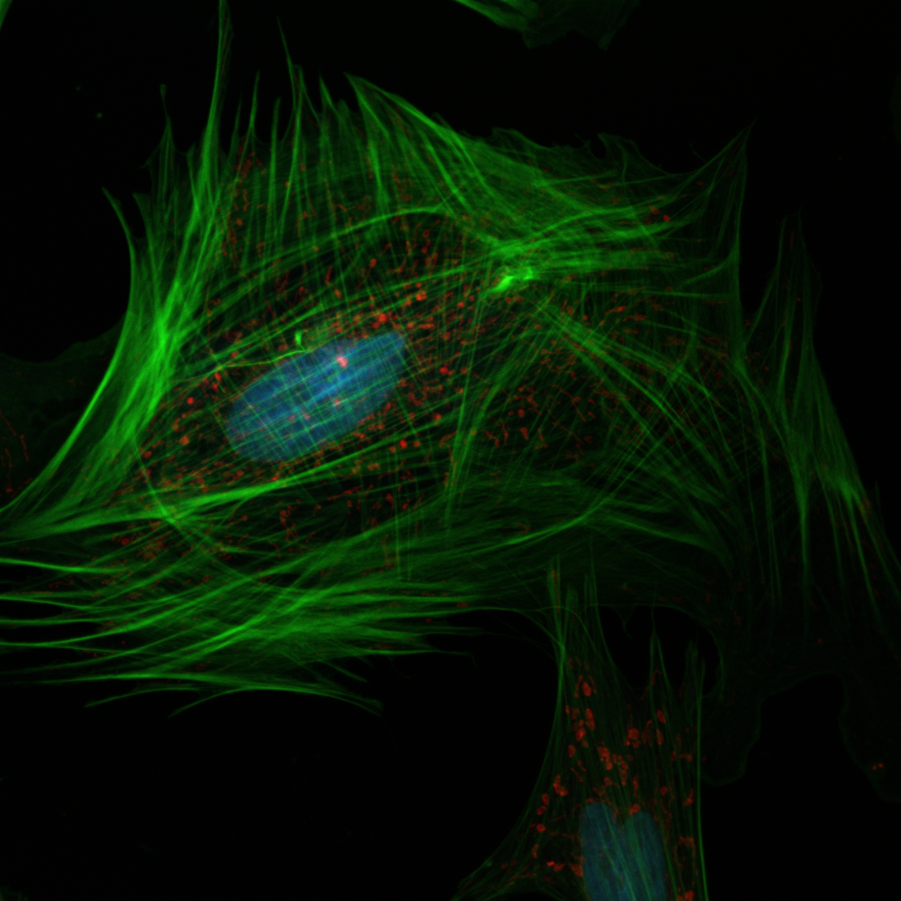
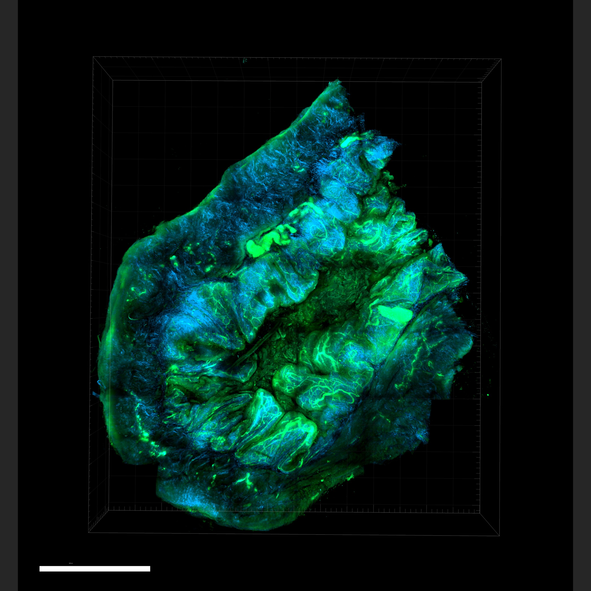
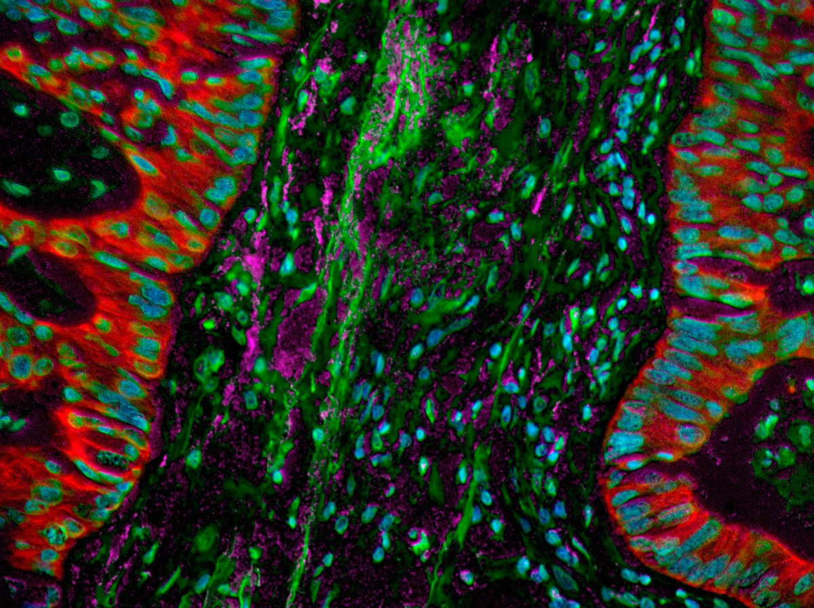

# Chapter 14: The Tumor Microenvironment

## 14.1 Components of the Tumor Microenvironment

The tumor microenvironment (TME) is a complex, dynamic ecosystem surrounding malignant cells that plays a crucial role in cancer initiation, progression, and metastasis. The TME, the environment surrounding the cancer cells, is a heterogeneous mixture of immune cells, endothelial cells, materials secreted from cells and their organelles, and fibroblasts. The tumor microenvironment (TME) is a complex biological structure surrounding tumor cells and includes blood vessels, immune cells, fibroblasts, adipocytes, and extracellular matrix (ECM).

*Figure 14.1 Tumor microenvironment: Within a tumor, cancer cells are surrounded by a variety of immune cells, fibroblasts, molecules, and blood vessels -- what's known as the tumor microenvironment. Cancer cells can change the microenvironment, which in turn can affect how cancer grows and spreads.
Source:	National Cancer Institute (NCI)*

### 14.1.1 Cancer-Associated Fibroblasts

Cancer-associated fibroblasts (CAFs) represent one of the most abundant and functionally important components of the tumor stroma. Cancer-associated fibroblasts (CAFs), a major component of the tumor microenvironment (TME), play an important role in cancer initiation, progression, and metastasis. Unlike normal fibroblasts, CAFs exhibit markedly different characteristics that promote tumorigenesis.

*Figure 14.2 Fibroblasts: A confocal microscopy image of a fibroblast showing the nucleus (blue), mitochondria (red), and actin cytoskeleton (green). As is evident from their large number of mitochondria, fibroblasts are very metabolically active, continuously synthesizing elements of the extracellular matrix and collagen. Tissue damage is a major trigger for the activation of fibroblasts from fibrocytes, and so fibroblasts play an important role in wound healing. Fibroblast assays are currently being studied as a means of predicting how normal tissue may respond to radiation therapy in cancer patients and others.
Source: NCI Center for Cancer Research. Creator: Guy Jones, Matthew Dreher, Brad Wood*

**Morphological and Functional Characteristics of CAFs**

CAFs, unlike normal fibroblasts (NF), are not passive bystanders. They possess similar characteristics to myofibroblasts, the fibroblasts responsible for wound healing and chronic inflammation, such as the expression of α-smooth muscle actin (α-SMA). Fibroblasts stem from a mesenchymal origin and have an elongated spindle or stellate shape with a multitude of cytoplasmic projections. Within the cytoplasm is an abundance of rough endoplasmic reticulum (rER) and a large Golgi apparatus.

**Origins and Activation of CAFs**

CAFs can originate from the activation and differentiation of quiescent fibroblasts, bone marrow-derived mesenchymal stem cells, and epithelial and endothelial cells. The transformation from normal fibroblasts to CAFs involves complex molecular programs that reprogram their phenotype and function.

**Metabolic Reprogramming in CAFs**

As cancer progresses, the CAFs also coevolve, transitioning from an inactivated state to an activated state. A critical aspect of CAF activation involves metabolic reprogramming, particularly the phenomenon known as the "reverse Warburg effect."

In the 1920s, Otto Warburg found that cancer cells preferably produce energy by converting glucose to lactic acid, even in aerobic conditions, to generate ATP rapidly. This is known as the Warburg effect. Interestingly, it was suggested that the reverse Warburg effect is the result of fibroblasts secreting lactate/pyruvate and epithelial cancer cells simultaneously taking up the energy-rich metabolites to utilize in the tricarboxylic acid (TCA) cycle.

Genetic alterations that result in the deactivation of caveolin-1 (Cav-1) expression lead to autophagy and aerobic glycolysis in cancer-associated fibroblasts. Subsequently, lactate, glutamine, and other metabolites that fuel biosynthesis are synthesized and exported to initiate oxidative metabolism in neighboring cancer cells.

**Functional Roles of CAFs**

Fibroblasts are the most common cell type represented in connective tissue. These cells produce a diverse group of products including collagen type I, III, and IV, proteoglycans, fibronectin, laminins, glycosaminoglycans, metalloproteinases, and even prostaglandins.

These cells synthesize reorganize the ECM found in the skin, lung, heart, kidney, liver, eye, and other organs. The ECM is in constant communication with the surrounding cells as fibroblasts can secrete and respond to both autocrine and paracrine signals.

### 14.1.2 Immune Cells in the Tumor Microenvironment

The immune system's role in cancer is complex and paradoxical, serving both tumor-suppressive and tumor-promoting functions depending on the context and activation state of different immune cell populations.

**Tumor-Associated Macrophages (TAMs)**

Inflammatory cells including macrophages, neutrophils, mast cells, and eosinophils are present in the TME. Tumour-associated macrophages (TAMs) are prototypic inflammatory cells, playing a key role in the orchestration of the TME.

Mononuclear phagocytes are extremely plastic. In the context of interferon-driven type 1 immune responses, macrophages acquire tumoricidal activity. However, in the tumor microenvironment, macrophages often adopt a phenotype that promotes rather than inhibits tumor growth.

Several studies indicate that tumor-associated macrophages (TAMs) usually have a pro-tumoral action, since they can stimulate angiogenesis, increase tumor cell invasion and motility, and have an immunosuppressive action.

*Figure 14.3 Tumor-Associated Macrophages: This image of a breast cancer tumor and its microenvironment was obtained from a live mouse model using multiphoton microscopy and endogenous fluorescence. That is, the image was obtained without any fluorophores, stains, or dyes, using only the metabolic co-factors of NADH and FAD, which are already inside of cells, along with second harmonic generation to see collagen. This technique has important clinical potential for patients who require label-free imaging, and may lead to more effective diagnoses and treatments. Tumor cells display in cyan, macrophages in red, collagen fibers in green.
source: National Cancer Institute \ Carbone Cancer Center at the Univ. of Wisconsin creators: Joseph Szulczewski, David Inman, Kevin Eliceiri, and Patricia Keely*

**Macrophage Polarization in the TME**

The phenotype of tumour-associated macrophages is shifted to a pro-fibrotic, pro-angiogenic phenotype, M2, characterized by production of arginase, IL-10, and TGF-β as well as IL-23.

IL-4 and IL-13 produced by Th2 cells or by eosinophils elicit alternative M2 polarization of macrophages, which results in tumour promotion. Evidence suggests that this pathway plays a dominant role in carcinoma of the breast and in pancreatic ductal adenocarcinoma.

**T Lymphocytes and Adaptive Immunity**

The immune system's antitumor activity is mainly carried out by tumor antigen-specific cytotoxic T lymphocytes (CTL), T effector (Teff) cells, antibody-producing B cells, as well as antigen-presenting dendritic cells (DC), which lead to adaptive immunity by directly recognizing and eliminating cancer cells.

Whereas a Th1-orchestrated cytotoxic T-cell-mediated response has a protective function, Th2-polarized T cells and Th17 cells trigger tumour-promoting cascades.

**Immunosuppressive Mechanisms**

Even though this defense system is well developed, the tumor often has the ability to develop an immunosuppressive microenvironment favorable to its progression. Specifically, myeloid-derived suppressor cells (MDSC), regulatory T (Treg) cells, and tumor-associated macrophages (TAMs) are well-known players.

Tumour progression and escape are associated with immunosuppressive pathways in innate and adaptive anti-tumour responses, which include, among others, suppressive myeloid cells, activation of checkpoint blockade, and induction and recruitment of Treg cells.

### 14.1.3 Endothelial Cells and Angiogenesis

Endothelial cells form the inner lining of blood vessels and play a crucial role in tumor angiogenesis—the formation of new blood vessels that supply nutrients and oxygen to growing tumors.

**Tumor Angiogenesis Mechanisms**

Angiogenesis, the growth of new capillary blood vessels, is central to the growth of cancer. Because the oxygen diffusion distance is 100 to 200 microns, tumor cells that exceed these distances from a capillary vessel become anoxic.

Vascular casts of metastases in the rabbit liver reveal that tumors of up to 1 mm in diameter are usually avascular, but beyond that size are vascularized. This size limitation necessitates the "angiogenic switch" for continued tumor growth.

*Figure 14.4 Steps of tumor angiogenesis: Step 1 (hypoxia): the hypoxic or inflamed tumor microenvironment (TME) induces the production of vasculogenetic growth factors. Step 2 (proteolytic degradation): VEGF-A and -D binding to VEGFR-2 induce the production of matrix metalloproteinases (MMPs), degrading the extracellular matrix (ECM). Step 3 (tip cell migration): VEGFR-2 activation induces the transformation of ECs to tip cells (brown). Step 4 (tube formation): tip cells migrate into the TME with coordinated proliferation of stalk cells, forming a new tube. Step 5 (tumor vascularization): the new vessels mature by establishing tight junctions and by the coverage by pericytes (lila).
source: Bokhari, S.M.Z.; Hamar, P. Vascular Endothelial Growth Factor-D (VEGF-D): An Angiogenesis Bypass in Malignant Tumors. Int. J. Mol. Sci. 2023, 24, 13317. via Wikimedia Commons*

**Angiogenic Factors and Signaling**

VEGF-A expression is greatly stimulated by tissue hypoxia and, perhaps independently, by low tissue pH, conditions that are commonly present in the tumor microenvironment.

VEGF-A action induces endothelial cells to express increased amounts of tissue factor, urokinase, tissue plasminogen activator and matrix metalloproteases. Collectively, these endothelial cell products induce clotting and initiate fibrinolysis and degradation of collagen and other elements of preexisting matrix, all-important steps in angiogenesis and stroma generation.

**Tumor Vasculature Characteristics**

A microscopic population of angiogenic tumor cells will begin to modify microvessels in the neighborhood by inducing an increase in vascular permeability, dilation, and tortuosity even before the induction of new vascular sprouts.

*Figure 14.5 Tumor angiogenesis in ovarian tumor microenvironment: In this image from a mouse model of ovarian cancer, optically cleared tumor excised from a murine SKOV tumor seeded with CD63+ cells reveals a high-resolution landscape of the three-dimensional tumor-stromal interfaces that comprise the tumor microenvironment (TME). Second harmonic signal (blue) and autofluorescent /GFP signals (green) demonstrates the interplay of collagen II fibrils and vessels generated from angiogenesis. The use of optical tissue clearing has the potential to greatly improve researchers' ability to assess the anatomic, structural, and cellular constituents that govern metastatic colonization in the TME at a single-cell resolution.
source: National Cancer Institute \ Comprehensive Cancer Center of Wake Forest Univ.  creator: Chris Booth, Kyle Cowdrick, Frank C. Marini*

## 14.2 Interaction between Cancer Cells and the Stroma

The relationship between cancer cells and stromal components is bidirectional and dynamic, with both compartments influencing each other's behavior and function through complex molecular crosstalk.

*Figure 14.5 Cancer cells and the stroma: As shown here, lung cancer is associated with a vast stromal desmoplastic reaction (the "neighborhood") in which the connective tissue, associated with the tumor, thickens similarly to scars. Cancer is in red; cell nuclei in cyan; stroma/desmoplasia in green; and an active stroma-specific marker in purple.
source: National Cancer Institute \ Fox Chase Cancer Center creator: Neelima Shah, Edna Cukierman*

### 14.2.1 Bidirectional Signaling Mechanisms

Accumulating evidence indicates that the epithelial and stromal compartments interact to enhance the aggressive nature of this disease. Pancreatic cancer cells release various factors that stimulate the stroma. Stromal cells, in turn, release mitogenic substances that stimulate tumor growth, invasion, and resistance to therapy.

**Cancer Cell-Derived Factors**

Stroma production is stimulated by cancer-cell derived growth factors including transforming growth factor-β (TGFβ), hepatocyte growth factor (HGF), fibroblast growth factor (FGF), insulin-like growth factor 1 (IGF-1) and epidermal growth factor (EGF).

Recent studies have demonstrated that Shh exerts its effect principally through a paracrine pathway in PDAC. These experiments have shown that Shh produced by tumor cells plays a key role in the recruitment and maintenance of the tumor mesenchyme.

**Stromal Cell-Derived Factors**

Global gene expression analysis of genes differentially expressed in fibroblasts cultured in the absence or presence of pancreatic cancer cell lines revealed 43 up-regulated and 31 down-regulated transcripts. Among the most highly up-regulated genes were members of the CXC/CC chemokine family including MCP-1 (CCL2), interleukin-(IL)-8 (CXCL8), GRO1 (CXCL1), and GRO2 (CXCL2); all of which have been implicated in tumor invasion and angiogenesis.

### 14.2.2 Metabolic Crosstalk

The metabolic interaction between cancer cells and stromal components represents a crucial aspect of tumor-stroma relationships, with important implications for tumor growth and therapeutic resistance.

**The Reverse Warburg Effect**

Cancer-associated fibroblasts undergo the reverse Warburg effect and provide cancer cells with glycolytic metabolites. This metabolic reprogramming allows for efficient energy utilization within the tumor microenvironment.

CAF-derived lactate is crucial in prostate cancer metabolic transformation towards OXPHOS. CAFs can transfer functional mitochondria to prostate cancer cells.

**Amino Acid and Lipid Metabolism**

CAFs augment cancer's addiction to glutamine and its metabolically relevant consequences. Alanine secreted by pancreatic stellate cells supports tumor metabolism.

CAFs act as lipid synthesis factories for colorectal cancer cells. Accumulation of fatty acids in the TME could serve as a nutrient reservoir for cancer cell growth during nutrient deprivation.

### 14.2.3 Mechanical Forces and Physical Interactions

The physical properties of the tumor microenvironment, including matrix stiffness, density, and organization, significantly influence cancer cell behavior and therapeutic response.

**Desmoplastic Reaction**

The desmoplastic reaction is composed of extracellular matrix (ECM) proteins, primarily type I and III collagen, fibronectin and proteoglycans; small endothelium lined vessels; and a diverse population of cells including inflammatory cells, fibroblasts and stellate cells.

The stroma can form up to 90% of the tumor volume, a property which is unique to pancreatic cancer. This extensive stromal component creates significant physical barriers that can impede therapeutic delivery.

**Matrix Remodeling**

Matrix reorganization occurs through a process of degradation and crosslinking enzymes, produced by fibroblasts, that are activated and regulated by pro-inflammatory cytokines and growth factors.

Transcription growth factor-alpha and beta (TGF-A and TGF-B), platelet-derived growth factor (PDGF), granulocyte-macrophage colony-stimulating factor (GM-CSF), epidermal growth factor (EGF), and tumor necrosis factor (TNF) all have implications in fibroblast regulation.

## 14.3 Inflammation and the Tumor Microenvironment

The relationship between inflammation and cancer has been recognized for over a century, with chronic inflammation serving as both a cause and consequence of malignant transformation.

### 14.3.1 Historical Perspective and Epidemiological Evidence

In 1863, Virchow proposed that cancer originates at sites of inflammatory responses. Based on extensive epidemiological studies in the 20th century, the association between persistent infections, inflammation, and the development of human cancers was conclusively established for several types of carcinomas and lymphomas.

### 14.3.2 Inflammatory Pathways in Cancer Development

**Chronic Inflammation and Carcinogenesis**

The pathways that are activated by persistent or repeated episodes of acute inflammation or by chronic inflammation and that contribute to tumour growth, invasion, and metastasis are illustrated. Continued recruitment of host inflammatory cells to the evolving tumour microenvironment in response to persistent infections, ongoing tissue injury, or upregulated production of cytokines and chemokines drives cancer development.

**Inflammatory Mediators**

Activated inflammatory cells, including neutrophils and macrophages, produce reactive oxygen species and reactive nitrogen species. These reactive species can cause DNA damage and contribute to genomic instability.

Key cytokines in tumour-associated inflammation are IL-1 and tumour necrosis factor alpha (TNF-α). IL-1 is produced by tumour, endothelial, and inflammatory cells and activates intracellular signalling pathways, including those of NF-κB, activator protein 1 (AP-1), and p38 mitogen-activated protein kinase (MAPK) and c-Jun N-terminal kinase (JNK), that stimulate production of mediators involved in inflammation, invasion, and angiogenesis.

### 14.3.3 Tumor-Promoting Inflammation

**Inflammatory Cell Recruitment**

According to CARR and UNDERWOOD, 1974, tumor cells stimulate the following phenomena: – the lymphoreticular reaction, with the invasion of lymphocytes, macrophages, lymphoreticular cells, immunologically active cells; – the vascular reaction, with the proliferation of endothelial cells and the formation of new capillaries; – the fibrous reaction, with fibroblast proliferation and collagen deposition; – the inflammatory reaction, with polymorphonuclear infiltration (neutrophils and eosinophils).

**Pro-tumorigenic Inflammatory Signaling**

TNF-α is a pro-inflammatory mediator produced by activated macrophages and tumour cells, leading to activation of NF-κB and signal transducer and activator of transcription 3 (STAT3). IL-6 also promotes tumour angiogenesis and invasion. Constitutive activation of NF-κB and STAT3 is found in several human tumours, and these factors act synergistically to sustain and enhance tumour-associated inflammation.

### 14.3.4 Matrix Metalloproteinases and Tissue Remodeling

Activation of MMPs in the tumour microenvironment promotes tumour cell migration and invasion, release of sequestered growth factors, and activation of latent forms of cytokines including IL-1β.

The T-lymphocyte subset TH17 produces IL-17, which upregulates IL-23 expression in the tumour microenvironment. IL-23 is a key cytokine in tumour growth and invasion; it causes upregulation of MMP-9 expression and increases angiogenesis and fibrosis.

## 14.4 Extracellular Matrix Remodeling

The extracellular matrix (ECM) serves as more than just a structural scaffold in the tumor microenvironment; it actively participates in tumor progression through dynamic remodeling processes that influence cancer cell behavior.

### 14.4.1 ECM Composition and Organization

**Normal vs. Tumor ECM**

The tumor microenvironment is composed of cellular components, bioactive substances, and extracellular matrix comprising of proteins such as collagens, proteoglycans, and the linear glycosaminoglycan hyaluronan.

For the most part, tumor stroma is formed by elements that are derived from the circulating blood and from adjacent host connective tissues. Generally speaking, the major components of tumor stroma include, in addition to new blood vessels, leaked plasma and plasma proteins; proteoglycans and glycosaminoglycans; interstitial collagens (primarily types I and III); fibrin; fibronectin; and cells of two general types, normal connective tissue cells such as fibroblasts and inflammatory cells that are derived from the blood.

### 14.4.2 ECM Remodeling Mechanisms

**Fibrin Deposition and Provisional Matrix Formation**

An important and almost immediate consequence of VEGF-A action is leakage of plasma proteins, including fibrinogen and other clotting factors. Vascular hyperpermeability and extravasation of plasma proteins leads to activation of the coagulation system by a tissue factor-mediated mechanism. As a result, extravasated plasma fibrinogen is rapidly clotted to form an extravascular gel of crosslinked fibrin.

Extravascular fibrin deposits are important because they dramatically alter the local microenvironment, transforming the erstwhile inert extravascular matrix of normal adult tissues into a proangiogenic provisional matrix that favors and apparently stimulates inward migration of host mesenchymal cells.

### 14.4.3 ECM and Cancer Cell Behavior

**Invasion and Metastasis**

The extracellular matrix (ECM), as part of the TME, is essential for asymmetric cell division and maintenance of tissue polarity; it may block or facilitate cell migration, determine the direction of cell–cell communication, and bind to growth factors to prevent their free diffusion.

**Therapeutic Implications**

Pancreatic cancer cells in vitro show a similar response to chemotherapeutic agents as cell lines derived from other solid tumors. However, pancreatic cancer patients have a limited response to drugs such as paclitaxel compared to breast and prostate cancer patients, suggesting that the unique tumor microenvironment in pancreatic cancer plays a role in chemoresistance.

### 14.4.4 Therapeutic Targeting of ECM

**Stromal Targeting Approaches**

The complex interaction between cancer cells and the tumor microenvironment in PDAC is beginning to be understood, and the disruption of these interactions is a promising new avenue for therapeutic targeting of PDAC.

Among these are therapies that reduce the tumor stroma, allowing for enhanced drug delivery to cancer cells, therapies that target specific signaling pathways within the stroma, and therapies that target the immune suppressive environment of the stroma.

## Clinical Implications and Future Directions

Understanding the tumor microenvironment has profound implications for cancer diagnosis, prognosis, and treatment. Quantification of the immune and inflammatory landscape of the TME has provided novel prognostic indicators of cancer progression, as shown by quantification of tumour-infiltrating T cells and TAMs.

The complexity of the tumor microenvironment necessitates a multi-faceted approach to cancer therapy that targets not only cancer cells but also the supporting stromal components. As we better understand the interactions between the stromal and epithelial cell compartments in pancreatic adenocarcinoma, it is becoming evident that anticancer therapies targeting the stroma, in addition to epithelial cells, may play a key role in improving clinical outcomes for patients with this deadly disease.

Future research directions include developing combination therapies that simultaneously target multiple components of the tumor microenvironment, understanding the temporal dynamics of TME evolution during cancer progression, and identifying biomarkers that predict response to microenvironment-targeted therapies.
